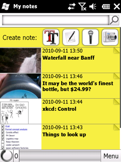

People's Note is a polished Windows Mobile notebook application with full-featured Evernote integration.

- Take your notes with you, quickly capture ideas or find memories.\
  
- View notes with all their formatting intact in full screen mode.\
  
- Quickly capture pictures to remember.\
  
- Jot down notes with a stylus.\
  
- Edit notes easily, add formatting and TODO checkboxes.\
  
- You can sign into Evernote to sync your notes over internet, but you don't have to.\
  
